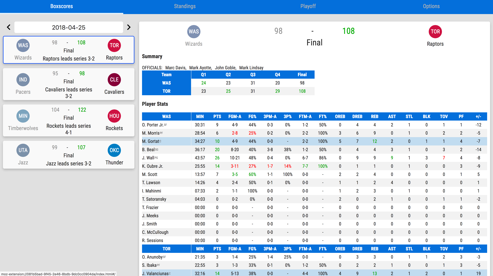
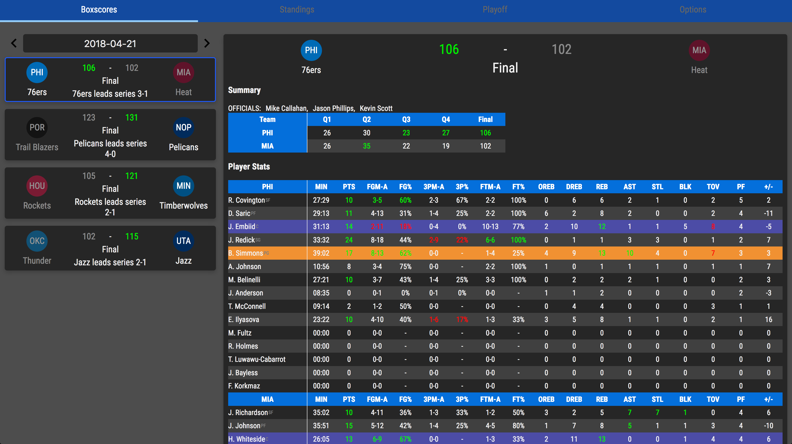
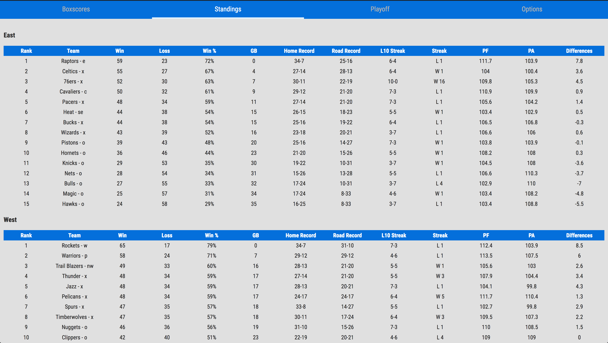
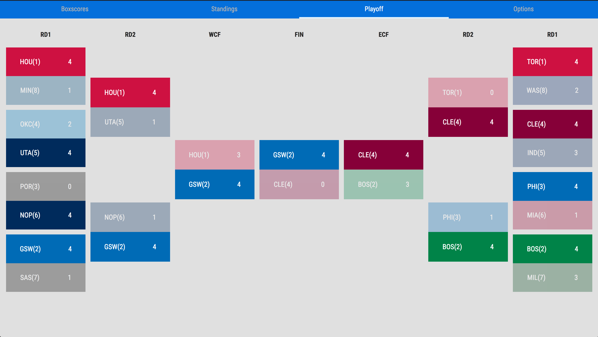

  

# Basketball Box Scores Extension

This is a browser extension shows the daily box score for NBA games.

## Get Basketball Box Scores Extension

It is available on **Chrome** and **Firefox**.

[Chrome](https://chrome.google.com/webstore/detail/box-scores/mfmkedeaebcckihpinmhkadoagdbifaa)

[Firefox](https://addons.mozilla.org/en-US/firefox/addon/box-scores-extension/)

## Screenshots

 

## Motivation

Sports websites don't usually have a convenient way to find out the latest box score.
This extension is for people who just want to get the latest update but too lazy to look it up.

## Features
1. Daily box score on the popup page
1. Full schedule list for the season
1. Ability to add favorite team which will be shown on top of the daily list
1. Playoff bracket for each season
1. Standings
1. Dark mode

## TODOs
- [X] Add build scripts
- [X] Convert into to use React, ES6, ~~SASS~~
- [ ] Add highlights to box score page
- [ ] Add the ability to sort tables

## Dev Quick Start
`/dist`: previous release
`/src/app`: react projects
`/src/build`: files of pre-release

### Prerequisite
You need to have `npm` installed.

### Running locally
1. Run `./build.sh`. A new zip should be created under the `/dist`

*Firefox*
1. Load the zip file into Firefox

*Chrome* (Chrome cannot load zip as extension locally.)
1. Load the `/src/build` folder into Chrome

#### Third party packages
* react-sticky-table
* react-flatpickr
* moment-timezone: for converting times to local time
