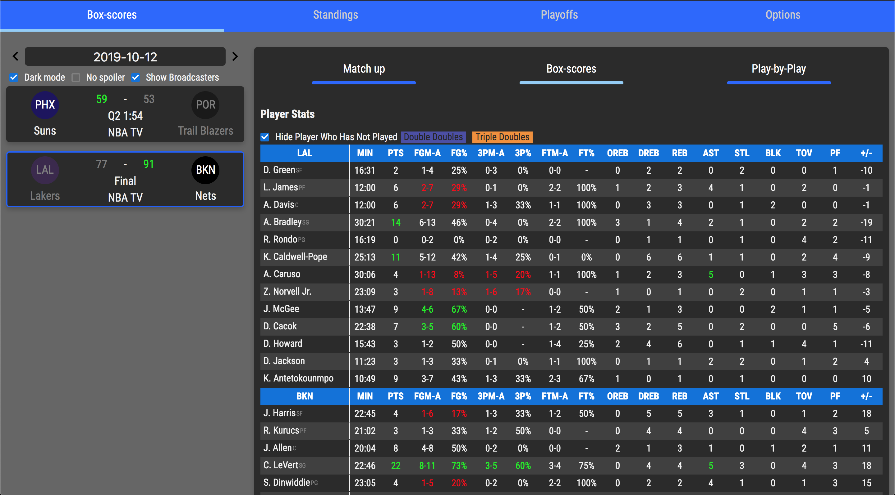

  

# Basketball Box Scores Extension

The best NBA browser extension!

## Get Basketball Box Scores Extension

- [Chrome](https://chrome.google.com/webstore/detail/box-scores/mfmkedeaebcckihpinmhkadoagdbifaa)
- [Firefox](https://addons.mozilla.org/en-US/firefox/addon/basketball-box-scores)

## Screenshots

Click me to see.

<h4>Boxscores overview with a highlight video</h4>

<h4>Boxscores player stats</h4>

<h4>Dark mode 🌙</h4>

<h4>standings</h4>

<h4>Playoff view</h4>

## Motivation

Sports websites don't usually have a convenient way to find out the latest box score.
This extension is for people who just want to get the latest update but too lazy to look it up.

## Features
- [x] Daily box score on the popup page
- [x] Highlight Videos from YouTube
- [x] Dark mode
- [x] Add favorite team
- [x] Playoff bracket for each season
- [x] Standings
- [x] Notifications

## Roadmap
- [ ] Add the ability to sort tables

---

## Dev start notes

### Prerequisite
You need to have `npm` installed.

### Running locally
- Run `./build.sh`. A new zip should be created under the `/dist`

**Firefox**
- Load the zip file into Firefox

**Chrome** (Chrome cannot load zip as extension locally)
- Load the `build` folder into Chrome

#### Third party packages
* `react-flatpickr`
* `moment-timezone`
